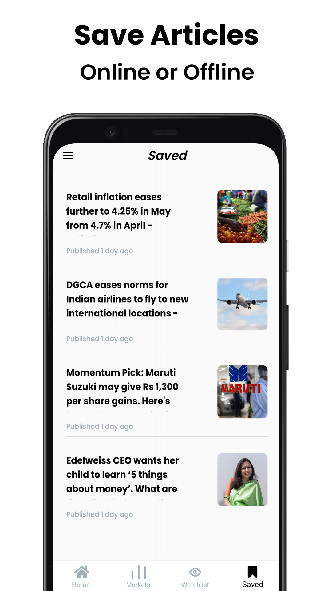

# News+

News+ is an Android app designed to provide Business & Financial News with the ability to save articles to read later, create watchlists of stocks & much more.

This repository contains the source code for News+ developed using the Flutter framework. The app is designed to provide various features and functionalities to enhance user experience. Below, you will find information about how to download the app, its features, dependencies, license, and more.

## Download

You can download the latest version of the app from the [GitHub Releases](https://github.com/sarthakkimtani/newsplus/releases) page. Look for the most recent release and download the corresponding APK or installer file for your device.

## Requirements

- Any Operating System (ie. MacOS X, Linux, Windows)
- Any IDE with Flutter SDK installed (ie. IntelliJ, Android Studio, VSCode, etc)
- A little knowledge of Dart and Flutter

## Features

- Dive into a vast collection of news articles from around the globe.
- Enjoy a seamless reading experience with a clean and intuitive interface.
- Save your favorite articles to read later.
- Stay ahead of the curve by creating your watchlist.
- Create a personalized library of articles that matter to you.

## Screenshots

  
 

## Installation

To run the app locally and make modifications, follow these steps:

1.  Ensure you have Flutter SDK installed on your machine. You can download it from the official Flutter website: https://flutter.dev.
2.  Clone this repository to your local machine using the following command:<br>
    ```bash
    git clone https://github.com/sarthakkimtani/newsplus.git
    ```
3.  Navigate to the project directory:<br><br>
    ```bash
    cd newsplus
    ```
4.  Fetch the app's dependencies by running the following command:<br>
    ```bash
    flutter pub get
    ```
5.  Create a new JSON file named `api_keys.json` & add your API Keys using:<br>

    ```json
    {
      "NEWS_API": "<API_KEY>",
      "STOCK_API": "<API_KEY>"
    }
    ```

    API Keys for News API can be found at [newsapi.org](https://newsapi.org/)<br>
    API Keys for Stock API can be found at [RapidAPI](https://rapidapi.com/apidojo/api/yh-finance)

6.  Register your app with Firebase and download the configuration files:
    - For Android, add `google-services.json` to your project's `app/` directory.
    - For iOS, add `GoogleService-Info.plist` to your project's root directory.
7.  Connect your device or start an emulator.
8.  Run the app using the following command:<br>
    ```bash
    flutter run --dart-define-from-file=api_keys.json
    ```

## Dependencies

| Name                                                                  | Usage                              |
| --------------------------------------------------------------------- | ---------------------------------- |
| [**HTTP**](https://pub.dev/packages/http)                             | HTTP Requests                      |
| [**Shimmer**](https://pub.dev/packages/shimmer)                       | Shimmer for Loading Screens        |
| [**Provider**](https://pub.dev/packages/provider)                     | State Management                   |
| [**Localstore**](https://pub.dev/packages/localstore)                 | JSON file-based storage package    |
| [**URL Launcher**](https://pub.dev/packages/url_launcher)             | URL Launcher for opening Web links |
| [**Firebase Core**](https://pub.dev/packages/firebase_core)           | Firebase Backend                   |
| [**Firebase Authentication**](https://pub.dev/packages/firebase_auth) | Firebase Authentication            |
| [**WebView**](https://pub.dev/packages/webview_flutter)               | WebView Widget                     |
| [**Cached Image**](https://pub.dev/packages/cached_network_image)     | Cache Network Images               |

## Contributing

Contributions to this app are welcome! If you find any issues or have ideas for improvements, please open an issue or submit a pull request. Make sure to follow the repository's guidelines for contributing.

## License

This app is distributed under the [MIT License](https://github.com/sarthakkimtani/newsplus/blob/main/LICENSE). Feel free to modify and use it as per your requirements.
